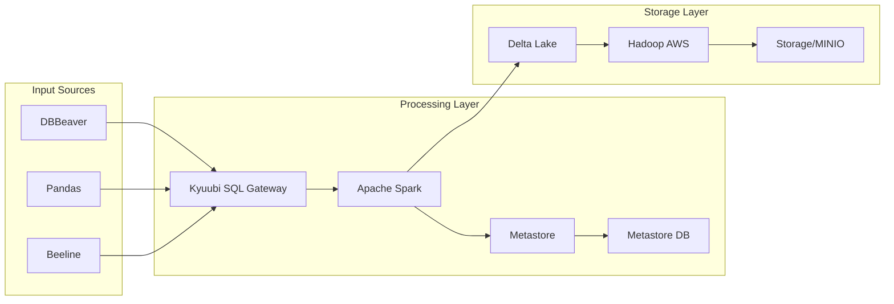

# The Delta Spark Handbook
This repo has all the resources you need to become an amazing data engineer focused on delta spark!

## Getting Started

[Getting Started](accelerator/materials/1-getting-started/readme.md)

## Architecture

I'll write a comprehensive description of the data pipeline architecture for your README.

# Data Pipeline Architecture

This data pipeline architecture implements a modern data processing and storage solution using a stack of open-source technologies. The system is containerized using Docker and Docker Compose for easy deployment and scalability.

## Components Overview

### Input Layer
- **DBBeaver**: A universal database tool for handling database connections and queries
- **Pandas**: Python data analysis library for data manipulation and preprocessing
- **Beeline**: Command-line interface for connecting to Hive and executing queries

### Processing Layer
- **Kyuubi SQL Gateway**: Serves as the SQL interface gateway, providing multi-tenant Spark SQL engines
- **Apache Spark**: Core processing engine for large-scale data processing and analytics
- **Metastore & Metastore DB**: 
  - Hive Metastore service for managing metadata
  - Stores metadata information about Spark SQL tables, partitions, and schemas

### Storage Layer
- **Delta Lake**: Storage layer that brings ACID transactions and versioning to data lakes
- **Hadoop AWS**: Provides integration with AWS services for data storage and processing
- **MINIO**: Object storage system compatible with Amazon S3 API

## Data Flow

1. Data enters the system through various input sources (DBBeaver, Pandas, or Beeline)
2. Kyuubi SQL Gateway manages the routing of queries and data to Spark engines
3. Apache Spark processes the data, interacting with the Metastore for metadata management
4. Processed data is stored in Delta Lake format
5. Final data is persisted in the storage layer through Hadoop AWS connectors to MINIO

## Containerization

The entire architecture is containerized using Docker, with Docker Compose orchestrating the multi-container application. This ensures:
- Consistent development and production environments
- Easy deployment and scaling
- Isolated services with defined networking
- Simplified dependency management

## Key Features

- **Multi-tenant Support**: Through Kyuubi SQL Gateway
- **ACID Compliance**: Provided by Delta Lake
- **Metadata Management**: Via Hive Metastore
- **Scalable Processing**: Using Apache Spark
- **S3-Compatible Storage**: Through MINIO
- **Multiple Access Methods**: Supporting various data tools and interfaces

## Use Cases

This architecture is suitable for:
- Data warehousing
- Real-time analytics
- Large-scale ETL operations
- Data lake implementations
- Business intelligence applications
- 

## Resources

Data Engineering Communities

- [Data Engineering Handbook](https://github.com/DataExpert-io-Community/data-engineer-handbook)

Sample Delta Lake Configuration Projects

- [Delta Lakehouse Docker](https://github.com/kemonoske/spark-minio-delta-lakehouse-docker)

