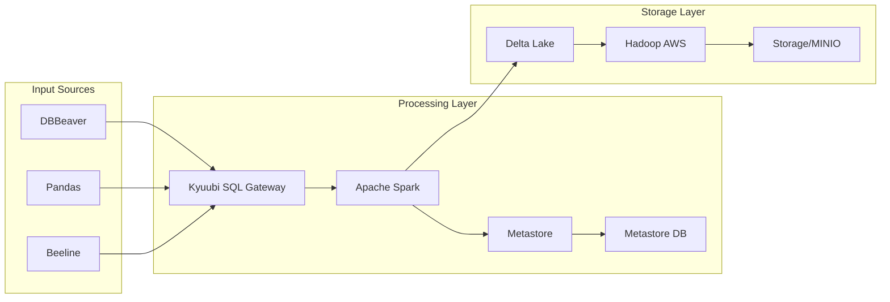

# The Delta Spark Handbook
This repo has all the resources you need to become an amazing data engineer focused on delta spark!

## Getting Started

[Getting Started](accelerator/materials/1-getting-started/readme.md)


## Architecture

I'll write a comprehensive description of the data pipeline architecture for your README.

# Data Pipeline Architecture

This data pipeline architecture implements a modern data processing and storage solution using a stack of open-source technologies. The system is containerized using Docker and Docker Compose for easy deployment and scalability.

## Components Overview

### Input Layer
- **DBBeaver**: A universal database tool for handling database connections and queries
- **Pandas**: Python data analysis library for data manipulation and preprocessing
- **Beeline**: Command-line interface for connecting to Hive and executing queries

### Processing Layer
- **Kyuubi SQL Gateway**: Serves as the SQL interface gateway, providing multi-tenant Spark SQL engines
- **Apache Spark**: Core processing engine for large-scale data processing and analytics
- **Metastore & Metastore DB**: 
  - Hive Metastore service for managing metadata
  - Stores metadata information about Spark SQL tables, partitions, and schemas

### Storage Layer
- **Delta Lake**: Storage layer that brings ACID transactions and versioning to data lakes
- **Hadoop AWS**: Provides integration with AWS services for data storage and processing
- **MINIO**: Object storage system compatible with Amazon S3 API

## Data Flow

1. Data enters the system through various input sources (DBBeaver, Pandas, or Beeline)
2. Kyuubi SQL Gateway manages the routing of queries and data to Spark engines
3. Apache Spark processes the data, interacting with the Metastore for metadata management
4. Processed data is stored in Delta Lake format
5. Final data is persisted in the storage layer through Hadoop AWS connectors to MINIO

## Containerization

The entire architecture is containerized using Docker, with Docker Compose orchestrating the multi-container application. This ensures:
- Consistent development and production environments
- Easy deployment and scaling
- Isolated services with defined networking
- Simplified dependency management

## Key Features

- **Multi-tenant Support**: Through Kyuubi SQL Gateway
- **ACID Compliance**: Provided by Delta Lake
- **Metadata Management**: Via Hive Metastore
- **Scalable Processing**: Using Apache Spark
- **S3-Compatible Storage**: Through MINIO
- **Multiple Access Methods**: Supporting various data tools and interfaces

## Use Cases

This architecture is suitable for:
- Data warehousing
- Real-time analytics
- Large-scale ETL operations
- Data lake implementations
- Business intelligence applications

## Architecture Diagram



## Comparison of Spark Storage Formats

# Storage Format Comparison

| Operation | Parquet | ORC | Delta Lake | Apache Iceberg |
|-----------|---------|-----|------------|----------------|
| **Basic Create** | ```sql CREATE TABLE t1 (id INT) USING PARQUET``` | ```sql CREATE TABLE t1 (id INT) USING ORC``` | ```sql CREATE TABLE t1 (id INT) USING DELTA``` | ```sql CREATE TABLE t1 (id INT) USING ICEBERG``` |
| **Partitioned Table** | ```sql CREATE TABLE t1 (id INT, dt DATE) USING PARQUET PARTITIONED BY (dt)``` | ```sql CREATE TABLE t1 (id INT, dt DATE) USING ORC PARTITIONED BY (dt)``` | ```sql CREATE TABLE t1 (id INT, dt DATE) USING DELTA PARTITIONED BY (dt)``` | ```sql CREATE TABLE t1 (id INT, dt DATE) USING ICEBERG PARTITIONED BY (dt)``` |
| **Insert Data** | ```sql INSERT INTO t1 VALUES (1)``` | ```sql INSERT INTO t1 VALUES (1)``` | ```sql INSERT INTO t1 VALUES (1)``` | ```sql INSERT INTO t1 VALUES (1)``` |
| **Merge/Upsert** | Not Supported | Not Supported | ```sql MERGE INTO t1 USING t2 ON t1.id = t2.id WHEN MATCHED THEN UPDATE...``` | ```sql MERGE INTO t1 USING t2 ON t1.id = t2.id WHEN MATCHED THEN UPDATE...``` |
| **Time Travel** | Not Supported | Not Supported | ```sql SELECT * FROM t1 VERSION AS OF 1``` | ```sql SELECT * FROM t1 FOR VERSION AS OF 1234567``` |
| **Schema Evolution** | Manual Alter Table | Manual Alter Table | ```sql ALTER TABLE t1 ADD COLUMN name STRING``` | ```sql ALTER TABLE t1 ADD COLUMN name STRING``` |
| **Streaming Write** | ```sql writeStream.format("parquet")``` | ```sql writeStream.format("orc")``` | ```sql writeStream.format("delta")``` | ```sql writeStream.format("iceberg")``` |
| **Delete Records** | Not Supported | Not Supported | ```sql DELETE FROM t1 WHERE id = 1``` | ```sql DELETE FROM t1 WHERE id = 1``` |
| **Update Records** | Not Supported | Not Supported | ```sql UPDATE t1 SET col = 'value' WHERE id = 1``` | ```sql UPDATE t1 SET col = 'value' WHERE id = 1``` |
| **Vacuum/Clean** | Manual File Delete | Manual File Delete | ```sql VACUUM t1 RETAIN 168 HOURS``` | ```sql CALL t1.system.rewrite_data_files()``` |

## Key Features Comparison


| Feature                   | Parquet | ORC | Delta Lake | Apache Iceberg |
|---------------------------|---------|-----|------------|----------------|
| ACID Transactions         | ❌       | ❌   | ✅          | ✅              |
| Schema Evolution          | Limited | Limited | ✅        | ✅              |
| Time Travel               | ❌       | ❌   | ✅          | ✅              |
| CDC Support               | ❌       | ❌   | ✅          | ✅              |
| Partition Evolution       | ❌       | ❌   | ✅          | ✅              |
| Row-level Operations      | ❌       | ❌   | ✅          | ✅              |
| Streaming Support         | Limited | Limited | ✅       | ✅              |
| Cloud Storage Support     | ✅       | ✅   | ✅          | ✅              |
| Metadata Management       | File-based | File-based | Transaction Log | Table Format |
| Unity Catalog Support     | ❌       | ❌   | ✅          | ✅              |
| Delta Sharing Support     | ❌       | ❌   | ✅          | Limited        |


## Storage Properties

| Property | Parquet | ORC | Delta Lake | Apache Iceberg |
|----------|---------|-----|------------|----------------|
| File Format | Columnar | Columnar | Parquet Based | Parquet Based |
| Compression | Snappy/GZIP | ZLIB/Snappy | Inherits Parquet | Inherits Parquet |
| Statistics | Basic | Advanced | Advanced | Advanced |
| Metadata Storage | File Level | File Level | Transaction Log | Metadata Tables |

## Example Use Cases

| Format | Best Used For |
|--------|--------------|
| Parquet | - Static analytics data<br>- Simple data lake storage<br>- When only columnar storage is needed |
| ORC | - Hive workloads<br>- Hadoop ecosystem<br>- Legacy systems integration |
| Delta Lake | - Data lakehouse architecture<br>- Real-time + batch processing<br>- When ACID is required<br>- Databricks ecosystem |
| Iceberg | - Cloud-native data lakes<br>- Multi-table transactions<br>- Complex schema evolution<br>- Vendor-neutral solution |

## Common Configuration Properties

```sql
-- Delta Lake Properties
CREATE TABLE delta_table
USING DELTA
TBLPROPERTIES (
    'delta.enableChangeDataFeed' = 'true',
    'delta.autoOptimize.optimizeWrite' = 'true'
);

-- Iceberg Properties
CREATE TABLE iceberg_table
USING ICEBERG
TBLPROPERTIES (
    'format-version' = '2',
    'write.merge.mode' = 'merge-on-read'
);

-- Parquet Properties
CREATE TABLE parquet_table
USING PARQUET
TBLPROPERTIES (
    'parquet.compression' = 'SNAPPY'
);

-- ORC Properties
CREATE TABLE orc_table
USING ORC
TBLPROPERTIES (
    'orc.compress' = 'SNAPPY'
);
```

## Resources

Data Engineering Communities

- [Data Engineering Handbook](https://github.com/DataExpert-io-Community/data-engineer-handbook)

Sample Delta Lake Configuration Projects

- [Delta Lakehouse Docker](https://github.com/kemonoske/spark-minio-delta-lakehouse-docker)

Minio Reverse Proxy Configuration
- [NGINX Minio Configuration](https://min.io/docs/minio/linux/integrations/setup-nginx-proxy-with-minio.html)